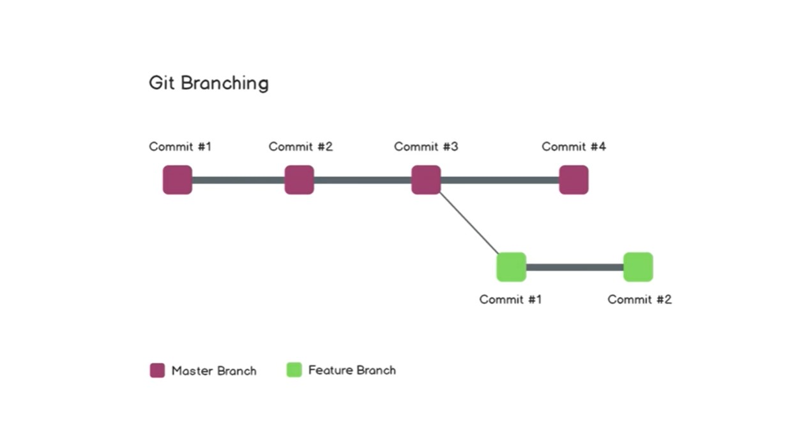

# demo-repo
This repo is just for demo and declared for learning tutorials.
welcome

# 1. Change on my local m/c
I am making a change in my system
/* Now run git status on terminal */
>> git status

you gonna see modified keyword

/* but let me make a new html file then re run git status */

you will get this result :
        On branch main/master
    Your branch is up to date with 'origin/main'.

    Changes not staged for commit:
    (use "git add <file>..." to update what will be committed)
    (use "git restore <file>..." to discard changes in working directory)
            modified:   README.md

    Untracked files:
    (use "git add <file>..." to include in what will be committed)
            index.html

So, index.html is new for git and untracked so we have to add it to the acknowledgement of git
so we will use
>> git add index.html  (or we can use add .) for all files

# Now run git status again
>>git status

we will get:

    Your branch is up to date with 'origin/main'.      

        Changes to be committed:
        (use "git restore --staged <file>..." to unstage)
                modified:   README.md 
                new file:   index.html

# Now to commit the changes in the repo
so far we have added a new index.file and now we have to save our workload
we gonna use:
> git commit -m "Added index.html" -m "we saved our first work successfully"

'-m' are used for giving title and description to the commit
we still saved the work locally not on gitHub

# Now the time has come to push (upload) our work on the hosted repo on GitHub
use command: push
> git push

if you are pushing the work for the first time you must have authenticate yourself with Git credentials
 we should use :
 > git push origin master/main

 defining the branch and repository where we want to push our work

 ## Go to Demo-repo2 for some additional resources RE: repo from local m/c

 # Git Branching

 ## Branching in Git
 
>>>>>>> 72e4c46f26a857f0c6e0771ef50e23da8bf2dd92
 

 if we want to make some addititve changes in our workflow but want to keep master/main branch preserved then we can make and swtich to another branch:
 -> Feature Branch :
    to add and test some new edits in the workflow
 -> Hot Fix branch :
    to eradicate some bugs from the workflow

If we want to keep changes and want to implement those changes in our main/master workflow
then we can merge the featured or Hot Fix branch to our main/master branch

### To check the branches
use command:
> git branch

### To make or switch between the branches
-> To create a new branch we use command 'checkout':
> git checkout -b feature01<name>

we will get:
    Switched to a new branch 'feature'

-> To switch between branches:
> git checkout <branch_name>
